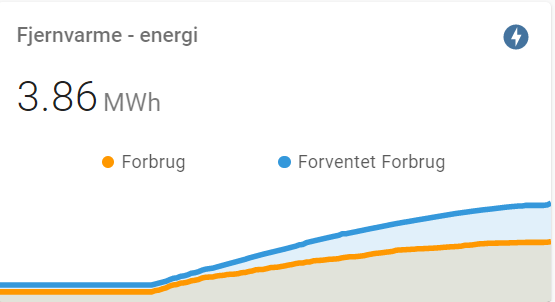

# eforsyning

[](https://github.com/custom-components/hacs)

The `eforsyning`component is a Home Assistant custom component for monitoring your regional heating supply data from eforsyning.dk

*The custom component in it's very early stage for showing data from eforsyning.dk.*

## Installation
---
### Manual Installation
  1. Copy eforsyning folder into your custom_components folder in your hass configuration directory.
  2. Configure the `eforsyning` sensor.
  3. Restart Home Assistant.

### Installation with HACS (Home Assistant Community Store)
  1. Ensure that [HACS](https://hacs.xyz/) is installed.
  2. Search for and install the `eforsyning` integration.
  3. Configure the `eforsyning` sensor.
  4. Restart Home Assistant.


## Configuration
---
Fully configurable through config flow.
  1. Head to configuration --> integration
  2. Add new and search for eforsyning
  3. Enter credentials and send

### Credentials and supplier ID
This part is a little tricky, but hang on:
  1. Username and password is the credentials written on the bill, and the ones you use to
     login with on the website normally.
  2. The supplier ID is a little more involved
  3. Visit the main page for [eforsyning](https://eforsyning.dk).
  4. If you are redirected to the login site of your regional supplier, click the small
      link "change supplier" (skift forsyning) to clear that cookie and go back.
  5. Press F12 in your browser (chrome at least) to get the developer tools.
     Select the "Network" tab and type "get" in the search field.
  6. On the web page you must find your supplier, and click it.  You are redirected to the
     login page for your supplier.
  7. In the Network traffic you should see a single line like this:
     `https://<SUPPLIER URL>/umbraco/dff/dffapi/GetVaerkSettings?forsyningid=<SUPPLIER ID (lots of digits and letters)>`
  8. Copy these numbers and letters into Home Assistant, and you should be ready to go.

## State and attributes
---
Many sensors are created - 14 in total actually.  The naming scheme is `sensor.eforsyning.<name>`.
The names are hopefully self-explanatory:

* energy_start
* energy_end
* energy_exp_end
* energy_exp_used
* energy_used
* water_start
* water_end
* water_exp_end
* water_used
* water_exp_used
* water_temperature_return
* water_exp_temperature_return
* water_temperature_meas_return
* water_temperature_forward

## Debugging
It is possible to debug log the raw response from eforsyning.dk API. This is done by setting up logging like below in configuration.yaml in Home Assistant. It is also possible to set the log level through a service call in UI.  

```
logger: 
  default: info
  logs: 
    pyeforsyning.eforsyning: debug
```

## Examples

### Daily average and gauge bar indicating high usage
Below example is an example how to display daily average and a guage indicating high usage. 




**Requirements**

* Recorder component holding minimum the number of days the average display should cover.
* Lovelace Config Template Card (https://github.com/iantrich/config-template-card)

```
